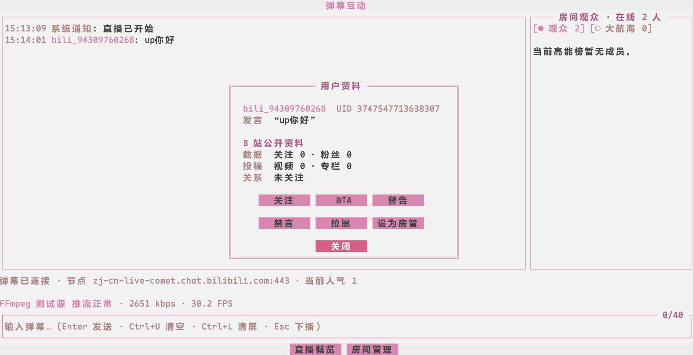
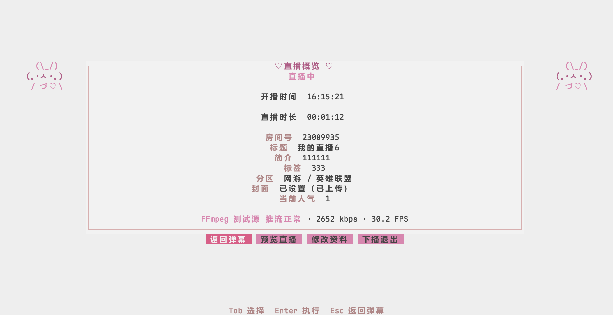

# bili-live-tui

`bili-live-tui` 是一个面向 B 站主播的终端控制台，将开播资料、OBS 或 FFmpeg 输出、弹幕互动和直播状态集中在一个界面中。



## 功能

- 扫码登录并保存本地会话
- 设置标题、分区、标签、简介、公告、封面和画面方向
- 连接 OBS Studio，自动写入直播地址并控制开始或停止
- 使用 FFmpeg 测试画面验证完整直播链路
- 收发弹幕，查看当前人气、直播状态和输出健康
- 使用 mpv 回看 B 站实际收到的直播画面
- 直播中编辑房间资料，异常中断时自动尝试下播

## 安装

从 [Releases](https://github.com/Ruixi-rebirth/bili-live-tui/releases) 下载对应平台的压缩包，解压后运行 `bili-live-tui`：

| 系统    | 架构       | 文件                               |
| ------- | ---------- | ---------------------------------- |
| Linux   | amd64      | `bili-live-tui_linux_amd64.tar.gz` |
| Linux   | arm64      | `bili-live-tui_linux_arm64.tar.gz` |
| macOS   | Intel      | `bili-live-tui_macos_amd64.tar.gz` |
| macOS   | Apple 芯片 | `bili-live-tui_macos_arm64.tar.gz` |
| Windows | amd64      | `bili-live-tui_windows_amd64.zip`  |

也可以使用 Nix 直接运行：

```bash
nix run github:Ruixi-rebirth/bili-live-tui
```

只关闭弹幕页面颜色时可添加 `--no-danmaku-color`，也可以设置标准环境变量 `NO_COLOR`：

```bash
nix run github:Ruixi-rebirth/bili-live-tui -- --no-danmaku-color
NO_COLOR=1 nix run github:Ruixi-rebirth/bili-live-tui
```

从源码运行需要 Go 1.26 或更高版本：

```bash
go run ./cmd/bili-live-tui
```

## 推流准备

正式直播默认使用 OBS Studio 30+。请在 OBS 中启用 WebSocket 5.x，保持默认地址 `127.0.0.1:4455`，并提前配置好场景、画面和声音来源。程序会写入 B 站直播地址并控制推流，但不会修改场景内容。

“FFmpeg 测试画面”用于验证直播链路，不需要 OBS，但要求系统已安装 `ffmpeg`。

直播概览中的“预览直播”会用 `mpv` 打开 B 站回拉画面，用来确认观众端实际能看到的内容。该功能默认静音以避免声音回授。

## 使用

启动程序后，使用哔哩哔哩手机客户端扫码确认登录。填写开播资料并选择输出方式，开播成功后即可在弹幕页面和直播概览之间切换。



封面支持 JPG、PNG 和 WebP，上传时会自动转换并调整尺寸。房间资料的长度和内容限制以 B 站接口返回结果为准。

## 本地数据

登录凭证保存在系统用户配置目录下的 `bili-live-tui/auth.json`。最近一次成功开播的设置保存在同目录的 `live-settings.json`，供下次启动时回填。配置文件仅允许当前用户读取，B 站推流码不会写入磁盘。

## 开发

```bash
go test ./...
go vet ./...
```

使用 Nix 时可运行 `nix develop` 进入开发环境，或运行 `nix build .#bili-live-tui` 构建程序。
