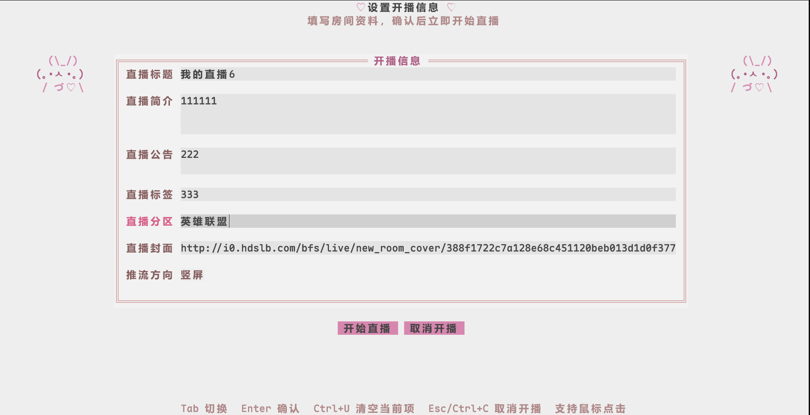
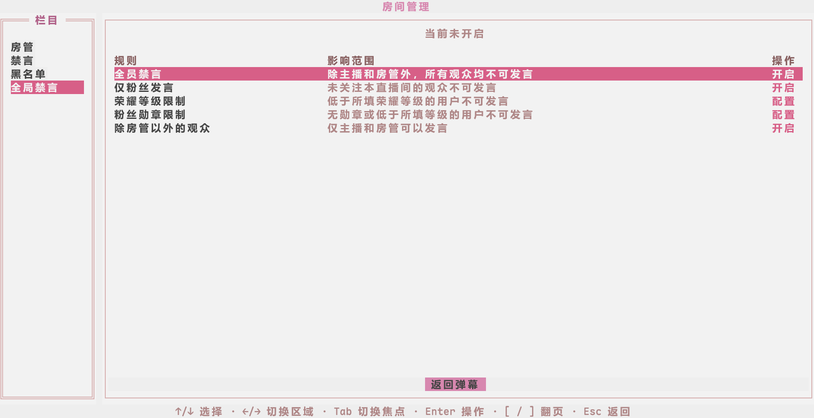

<div align="center">

# 📺 bili-live-tui

**面向 Bilibili 主播的轻量级终端直播控制台**

*突破 5000 粉丝推流限制，让 Linux / macOS / Windows 都能自由使用 OBS 推流。集开播设置、自动联动、实时弹幕与房管治理于一体。*

<br>

[](https://github.com/Ruixi-rebirth/bili-live-tui/releases)
[](https://go.dev/)
[-302F38?style=flat-square&logo=obsstudio&logoColor=white)](https://obsproject.com/)
[](https://github.com/Ruixi-rebirth/bili-live-tui/releases)
[](https://nixos.org/)
[](LICENSE)

<br>

[⚡ 快速上手](#-快速上手-30-秒开播) • [📦 依赖工具](#-依赖工具) • [💡 设计初衷](#-设计初衷) • [✨ 功能概览](#-功能概览) • [🎮 OBS 联动配置](#-obs-联动配置) • [⌨️ 快捷键速查](#️-快捷键速查) • [🔒 隐私与安全](#-隐私与安全保障)

</div>

---

## 💡 设计初衷

在 B 站直播时，许多中小主播面临一个尴尬的限制：**粉丝不足 5000 时，官方网页端不提供 RTMP 推流码，强制要求使用官方“直播姬”；而官方直播姬只有 Windows 版本，导致 Linux 和 macOS 用户在粉丝未达标时无法在电脑开播。**

`bili-live-tui` 打破了这一限制，把整套开播工作流装进一个轻巧简单的终端工具里：

- **0 门槛拿推流码**：不用等 5000 粉丝，任何账号都能直接获取 B 站官方 RTMP 推流地址与推流码，让 Linux、macOS 与 Windows 都能自由使用 OBS Studio 或 FFmpeg 开播。
- **自动联动 OBS**：开播时自动把推流地址填进 OBS 并开始推流，下播自动停止，不用每次手动复制粘贴。
- **扫码秒速登录**：终端直接画出二维码，手机 B 站扫码即登，凭据本机私有保存，后续启动自动免扫码。
- **轻巧省资源**：常驻内存仅几十兆，后台无负担，无需为了看弹幕长挂吃内存的网页，把电脑性能留给游戏和推流编码。
- **全功能一站式**：开播设置、收发弹幕、看观众资料、禁言房管、画面预览与推流监控，一个界面全搞定。
- **安全防泄露**：只连 B 站官方和本地 OBS，登录信息仅保存在本机，推流码绝不写入硬盘，不用担心意外泄露。

---

## ✨ 功能概览

### 1. 开播设置与 OBS 联动推流

启动后自动记住上次填写的标题、分区、标签、公告、简介与封面。设置好后直接回车，程序会自动向 B 站申请开播，并通知 OBS 同步开始推流。

<p align="center">
  
  <br>
  <em>▲ 开播信息配置：支持多级分区选择、本地封面自适应压缩上传与推流模式设定</em>
</p>

- 🖼️ **封面智能上传**：直接填入本地图片路径（支持 JPG、PNG、WebP），自动按 B 站标准裁剪并上传为房间封面。
- 🧪 **极简链路测试**：没装 OBS 也能直接调用本机的 `ffmpeg` 自动生成测试画面推流，快速验证直播链路是否正常。

---

### 2. 实时弹幕与互动卡片

弹幕实时秒到，醒目呈现普通弹幕、礼物、醒目留言（SC）、大航海（舰长/提督/总督）进房与高能榜变化。

<p align="center">
  
  <br>
  <em>▲ 实时弹幕流、右侧高能榜与一键呼出的用户画像/房管操作弹窗</em>
</p>

- ⌨️ **快速回弹幕**：直接在底部输入框打字，敲回车即可把弹幕发送到直播间。
- 👤 **观众资料卡**：点击任意发言观众可呼出资料卡（查看勋章、大航海等级、UID、个人主页等），并能直接 `@TA`、关注/取关、警告、禁言、拉黑或任免房管。
- 🚨 **超管警告提醒**：实时接收 B 站官方超管的整改警告或切断通知，第一时间全屏提醒，防止违规封禁。

---

### 3. 房间管理工作区

不用开网页后台，在终端里直接搞定房管、禁言和直播间秩序。

<p align="center">
  
  <br>
  <em>▲ 房间管理中心：房管任免、禁言名单、按时长禁言、黑名单与全局禁言配置</em>
</p>

- 🛡️ **房管任免**：查看房管数量与名额上限，支持添加或撤销普通房管、高级房管。
- ⏱️ **禁言管理**：输入用户名或 UID 快速禁言，支持按需设置时长，随时一键解禁。
- 🚫 **黑名单管理**：查看房间黑名单，支持按用户名或 UID 快速拉黑或移出。
- 🔒 **全员禁言控制**：突发节奏或刷屏时，可一键开启全员禁言、仅粉丝发言、限制等级或粉丝牌发言。

---

### 4. 直播状态与推流监控

随时切到概览看板，查看直播时长、在线人气和推流状态。

<p align="center">
  
  <br>
  <em>▲ 直播概览看板：推流健康指标、在线人气、免下播修改房间资料与一键 MPV 回看</em>
</p>

- 📈 **推流指标看板**：实时查看推流码率、帧率、丢帧情况与 OBS CPU 占用，网络波动一清二楚。
- 🔄 **免关播改资料**：直播打完游戏想换分区闲聊？中途直接改标题、分区和公告，无需下播重开。
- 🎬 **观众视角回看**：一键调起本地 `mpv` 播放器查看观众实际看到的画面，超低延迟且默认静音，防止麦克风啸叫。
- 🔄 **断线接管守护**：如果不小心关掉了终端或网络中断，再次打开会自动检测到正在直播，点一下就能继续接管弹幕与管理。

---

## 📦 依赖工具

`bili-live-tui` 为单文件免安装程序，根据你使用的功能按需配合以下外部工具：

| 工具 | 类型 | 用途说明 |
| :--- | :--- | :--- |
| **OBS Studio** | **推荐** | 正式推流工具（版本 30+，开启自带的 WebSocket 即可） |
| **mpv** | 可选 | 在概览中点击「预览直播」超低延迟回看观众端画面（默认静音防啸叫） |
| **FFmpeg** | 可选 | 仅在使用「FFmpeg 测试源」测试推流链路时需要 |

> [!TIP]
> 如果未能自动找到对应工具，在点击「开始直播」或「预览直播」时，终端会弹窗提示你输入该程序的可执行文件完整路径。填入并保存一次后就会自动记住，无需手动配置环境变量。

---

## ⚡ 快速上手 (30 秒开播)

### 方式 1：下载预编译二进制（解压即用）

从 [GitHub Releases](https://github.com/Ruixi-rebirth/bili-live-tui/releases) 下载对应系统的预编译压缩包，解压后运行即可：

| 操作系统    | 架构类型              | 预编译下载文件                                                                                       |
| :---------- | :-------------------- | :--------------------------------------------------------------------------------------------------- |
| **Linux**   | x86_64 (amd64)        | [`bili-live-tui_linux_amd64.tar.gz`](https://github.com/Ruixi-rebirth/bili-live-tui/releases/latest) |
| **Linux**   | AArch64 (arm64)       | [`bili-live-tui_linux_arm64.tar.gz`](https://github.com/Ruixi-rebirth/bili-live-tui/releases/latest) |
| **macOS**   | Apple Silicon (M系列) | [`bili-live-tui_macos_arm64.tar.gz`](https://github.com/Ruixi-rebirth/bili-live-tui/releases/latest) |
| **macOS**   | Intel x86_64          | [`bili-live-tui_macos_amd64.tar.gz`](https://github.com/Ruixi-rebirth/bili-live-tui/releases/latest) |
| **Windows** | 64 位 (amd64)         | [`bili-live-tui_windows_amd64.zip`](https://github.com/Ruixi-rebirth/bili-live-tui/releases/latest)  |

### 方式 2：从源码安装与编译

要求本地环境安装有 **Go 1.26+**：

```bash
# 一键安装到 $GOPATH/bin
go install github.com/Ruixi-rebirth/bili-live-tui/cmd/bili-live-tui@latest

# 或克隆仓库后本地运行
git clone https://github.com/Ruixi-rebirth/bili-live-tui.git
cd bili-live-tui
go run ./cmd/bili-live-tui
```

### 方式 3：Nix 运行

如果你是 Nix / NixOS 用户，一条命令直接运行：

```bash
nix run github:Ruixi-rebirth/bili-live-tui
```

### 📱 扫码登录认证

首次启动时，终端会直接渲染登录二维码。使用**哔哩哔哩手机客户端**扫码并确认登录即可。登录成功后凭据保存在本地私有目录，后续启动**自动免扫码登录**。

---

## 🎮 OBS 联动配置

`bili-live-tui` 原生支持 **OBS Studio 30+**（内置 WebSocket 5.x 协议），只需 3 步即可自动联动：

1. **打开 OBS Studio**，点击顶部菜单栏 `工具 (Tools)` ➔ `WebSocket 服务器设置 (WebSocket Server Settings)`。
2. **勾选「启用 WebSocket 服务器」**，端口保持默认的 `4455`。
3. （可选）如果在 OBS 里设置了连接密码，开播时在终端界面填入相同密码即可。

> [!TIP]
> 只要提前在 OBS 里排好你的游戏、摄像头和麦克风。开播时，工具会自动把 B 站分配的推流地址填进 OBS 并开始推流，绝不会改动你排好的画面场景。如果开播时还没打开 OBS，工具还会尝试帮你自动启动它。

---

## ⌨️ 快捷键速查

支持键盘快捷键与鼠标点击操作：

### 📋 开播配置界面

| 快捷键              | 功能说明                                     |
| :------------------ | :------------------------------------------- |
| `Tab` / `Shift+Tab` | 在表单各输入项与底部按钮之间切换焦点         |
| `Enter`             | 确认当前项；在「开始直播」按钮上触发开播     |
| `Ctrl+U`            | 清空当前聚焦输入框内容                       |
| `←` / `→`           | 在「开始直播」与「取消开播」按钮间切换       |
| `Esc` / `Ctrl+C`    | 取消开播并退出                               |

### 💬 弹幕互动工作区

| 快捷键              | 功能说明                                                     |
| :------------------ | :----------------------------------------------------------- |
| `Tab` / `Shift+Tab` | 循环切换焦点（输入框 ⇄ 操作按钮 ⇄ 弹幕流 ⇄ 高能榜）          |
| `Enter`             | （输入框聚焦）发送弹幕                                       |
| `←` / `→`           | （高能榜聚焦）切换高能用户榜与大航海榜                       |
| `Ctrl+U`            | 清空输入框内容                                               |
| `Ctrl+L`            | 清空屏幕历史弹幕（清屏）                                     |
| `Esc`               | 呼出下播确认弹窗                                             |
| `Ctrl+C`            | 快速安全下播并退出                                           |

### 👤 观众卡片弹窗

| 快捷键                | 功能说明                                                     |
| :-------------------- | :----------------------------------------------------------- |
| `↑` / `↓` / `←` / `→` | 在各操作按钮间移动                                           |
| `Enter`               | 执行选中的操作（`@TA`、禁言、拉黑、任免房管等）               |
| `Esc`                 | 关闭资料卡片                                                 |

### 🛡️ 房间管理工作区

| 快捷键              | 功能说明                                                     |
| :------------------ | :----------------------------------------------------------- |
| `↑` / `↓`           | 切换管理栏目（房管/禁言/黑名单/全局禁言）或选择表格行        |
| `Tab` / `Shift+Tab` | 切换焦点区域（栏目 ⇄ 表格 ⇄ 按钮）                          |
| `[` 或 `PageUp`     | 列表上一页                                                   |
| `]` 或 `PageDown`   | 列表下一页                                                   |
| `Enter`             | 执行选中的操作                                               |
| `Esc`               | 退出房间管理，返回弹幕主界面                                 |

---

## 💡 命令行实用选项

除交互界面外，`bili-live-tui` 还提供轻量子命令与选项，方便终端快速操作或脚本调用：

### 命令（Commands）

| 命令 | 功能说明 |
| :--- | :--- |
| `bili-live-tui status` | 查看当前直播间开播状态、已播时长、标题分区与推流状态 |
| `bili-live-tui stop` | 一键向 B 站发送下播请求并停止推流，无需进入图形界面 |
| `bili-live-tui logout` | 退出登录并安全清除本机保存的凭据 |
| `bili-live-tui completion <shell>` | 生成 Shell 自动补全脚本（支持 `bash`、`zsh`、`fish`） |

### 选项（Flags）

| 选项 | 作用说明 |
| :--- | :--- |
| `--no-save-auth` | **临时免存模式**：不读取本机已存凭据，扫码登录后也绝不向本地写入凭据，退出即失效，适合在公用电脑或临时设备上使用 |
| `--no-color` | **禁用界面颜色高亮**：关闭终端自定义色彩（也可通过标准环境变量 `NO_COLOR=1` 触发） |
| `-h`, `--help` | 查看当前命令的详细用法与参数帮助 |

### 实用示例

```bash
# 查看当前直播间开播与推流状态
bili-live-tui status

# 一键快速关播
bili-live-tui stop

# 退出登录并清除本机凭据
bili-live-tui logout

# 在他人电脑临时开播（不留下本地登录凭据）
bili-live-tui --no-save-auth

# 禁用终端颜色高亮
bili-live-tui --no-color

# 载入 Zsh 命令行补全
source <(bili-live-tui completion zsh)
```

---

## 🔒 隐私与安全保障

- **官方直连**：只与 Bilibili 官方接口和本地 OBS 通信，没有第三方中转服务器，不收集任何用户数据。
- **本地私有存储**：登录凭据（`auth.json`）与开播设置（`live-settings.json`）仅保存在本机，严格限制只有当前系统用户可读，具备防文件损坏保护。
- **推流码绝不落盘**：推流码直接从内存传给本地 OBS，绝不以明文或文件形式保存在硬盘上，从根源上杜绝推流码意外泄露。
- **支持随时登出与临时免存**：随时执行 `bili-live-tui logout` 一键清除本机凭据；在公共设备上可加 `--no-save-auth` 临时登录，退出后凭据随内存销毁。

---

## 🛠️ 开发与测试

欢迎参与 `bili-live-tui` 的改进与建设！

```bash
# 运行单元测试
go test ./...

# 运行静态代码检查
go vet ./...
```

对于 Nix 用户：

```bash
# 进入配置完善的开发环境（包含 Go 1.26、gopls、gotools）
nix develop

# 构建 Flake 包
nix build .#bili-live-tui
```

---

## 📄 开源许可证

本项目采用 [MIT License](LICENSE) 开源许可证，可自由学习、使用与扩展。
